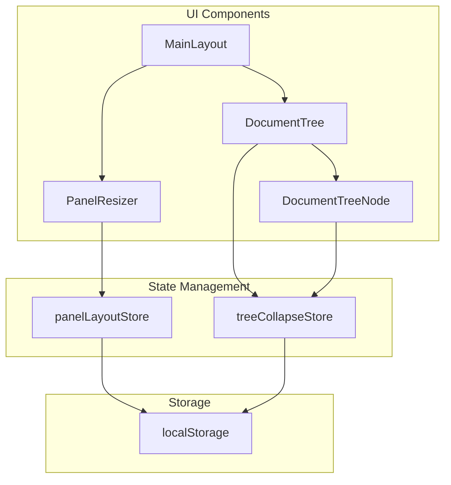

# Design Document

## Overview

本设计为语雀桌面应用实现可调整面板布局和文档树折叠功能。采用 React + TypeScript 技术栈，使用 Zustand 进行状态管理，localStorage 进行持久化存储。

## Architecture



## Components and Interfaces

### PanelResizer Component

可拖动的面板分隔条组件。

```typescript
interface PanelResizerProps {
  /** 拖动方向 */
  direction: 'horizontal' | 'vertical'
  /** 拖动时的回调，返回位移量 */
  onResize: (delta: number) => void
  /** 拖动结束时的回调 */
  onResizeEnd?: () => void
  /** 自定义样式类名 */
  className?: string
}

function PanelResizer({ direction, onResize, onResizeEnd, className }: PanelResizerProps): JSX.Element
```

### Panel Layout Store

面板布局状态管理。

```typescript
interface PanelLayoutState {
  /** 左侧边栏宽度 */
  sidebarWidth: number
  /** 右侧预览面板宽度 */
  previewWidth: number
  /** 设置侧边栏宽度 */
  setSidebarWidth: (width: number) => void
  /** 设置预览面板宽度 */
  setPreviewWidth: (width: number) => void
  /** 从 localStorage 加载布局 */
  loadLayout: () => void
  /** 保存布局到 localStorage */
  saveLayout: () => void
}

const usePanelLayoutStore: UseBoundStore<StoreApi<PanelLayoutState>>
```

### Tree Collapse Store

文档树折叠状态管理。

```typescript
interface TreeCollapseState {
  /** 按知识库 ID 存储的折叠节点集合 */
  collapsedNodes: Record<string, Set<string>>
  /** 切换节点折叠状态 */
  toggleNode: (bookId: string, nodeId: string) => void
  /** 检查节点是否折叠 */
  isCollapsed: (bookId: string, nodeId: string) => boolean
  /** 折叠所有节点 */
  collapseAll: (bookId: string, nodeIds: string[]) => void
  /** 展开所有节点 */
  expandAll: (bookId: string) => void
  /** 加载指定知识库的折叠状态 */
  loadCollapseState: (bookId: string) => void
  /** 保存指定知识库的折叠状态 */
  saveCollapseState: (bookId: string) => void
}

const useTreeCollapseStore: UseBoundStore<StoreApi<TreeCollapseState>>
```

### Updated DocumentTree Props

```typescript
interface DocumentTreeProps {
  documents: Document[]
  loading?: boolean
  emptyMessage?: string
  selectedIds?: Set<string>
  onSelectionChange?: (ids: Set<string>) => void
  selectable?: boolean
  bookInfo?: { userLogin: string; slug: string }
  bookId?: string  // 新增：用于折叠状态持久化
  onPreview?: (doc: Document) => void
}
```

## Data Models

### localStorage Keys

| Key | Type | Description |
|-----|------|-------------|
| `yuque-panel-layout` | `{ sidebarWidth: number, previewWidth: number }` | 面板布局配置 |
| `yuque-tree-collapse-{bookId}` | `string[]` | 指定知识库的折叠节点 ID 列表 |

### Panel Width Constraints

```typescript
const PANEL_CONSTRAINTS = {
  sidebar: { min: 180, max: 400, default: 220 },
  documentList: { min: 250 },  // 中间区域自动计算
  preview: { min: 300, max: 800, default: 500 }
}
```

## Error Handling

| Scenario | Handling |
|----------|----------|
| localStorage 不可用 | 使用默认值，不持久化 |
| 保存的宽度超出约束 | 自动修正到约束范围内 |
| 保存的折叠状态包含无效节点 ID | 忽略无效 ID，正常渲染 |
| 窗口尺寸变化导致面板过宽 | 自动调整到合理范围 |


## Correctness Properties

*A property is a characteristic or behavior that should hold true across all valid executions of a system—essentially, a formal statement about what the system should do. Properties serve as the bridge between human-readable specifications and machine-verifiable correctness guarantees.*

### Property 1: Panel Width Clamping

*For any* panel width value, the clamped result SHALL be within the defined constraints (min ≤ result ≤ max). If the input is below minimum, the result equals minimum; if above maximum, the result equals maximum; otherwise, the result equals the input.

**Validates: Requirements 1.3, 1.4**

### Property 2: Panel Layout Round-Trip Persistence

*For any* valid panel layout configuration (sidebarWidth, previewWidth), saving to localStorage and then loading SHALL produce an equivalent configuration.

**Validates: Requirements 1.5, 2.1, 2.2, 2.4**

### Property 3: Toggle Collapse State

*For any* tree node, toggling its collapse state twice SHALL return it to its original state. If initially expanded, toggle → collapsed → toggle → expanded.

**Validates: Requirements 3.2, 3.3**

### Property 4: Collapse/Expand All Operations

*For any* document tree with folder nodes:
- After `collapseAll`, all folder node IDs SHALL be in the collapsed set
- After `expandAll`, the collapsed set SHALL be empty

**Validates: Requirements 4.2, 4.3**

### Property 5: Collapse/Expand All Idempotence

*For any* document tree state:
- `collapseAll(collapseAll(state))` SHALL equal `collapseAll(state)`
- `expandAll(expandAll(state))` SHALL equal `expandAll(state)`

**Validates: Requirements 4.4, 4.5**

### Property 6: Collapse State Round-Trip Persistence

*For any* bookId and set of collapsed node IDs, saving to localStorage and then loading for the same bookId SHALL produce an equivalent set.

**Validates: Requirements 5.1, 5.2, 5.4**

## Testing Strategy

### Property-Based Testing

使用 `fast-check` 库进行属性测试，每个属性至少运行 100 次迭代。

```typescript
// 测试配置示例
import fc from 'fast-check'

// Property 1: Width clamping
fc.assert(
  fc.property(
    fc.integer({ min: 0, max: 2000 }),
    (width) => {
      const clamped = clampWidth(width, MIN, MAX)
      return clamped >= MIN && clamped <= MAX
    }
  ),
  { numRuns: 100 }
)
```

### Unit Tests

单元测试覆盖以下场景：
- 默认值应用 (Requirement 2.3)
- 无保存状态时的默认展开 (Requirement 5.3)
- 边界条件（最小/最大宽度边界）
- 错误处理（localStorage 不可用）

### Test File Structure

```
packages/yuque-desktop/src/
├── stores/
│   ├── panelLayoutStore.ts
│   ├── panelLayoutStore.test.ts      # 单元测试 + 属性测试
│   ├── treeCollapseStore.ts
│   └── treeCollapseStore.test.ts     # 单元测试 + 属性测试
├── components/
│   ├── ui/
│   │   ├── PanelResizer.tsx
│   │   └── PanelResizer.test.tsx     # 组件测试
│   └── DocumentTree.tsx              # 已存在，需修改
```

### Testing Framework

- **Property-based testing**: fast-check (已在 devDependencies 中)
- **Unit testing**: vitest (已配置)
- **Test runner**: `pnpm test` 或 `pnpm test:watch`
